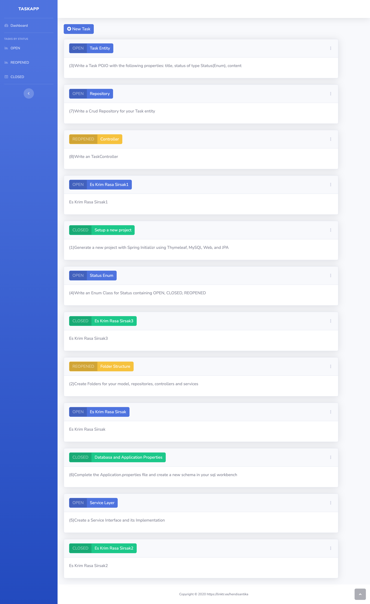
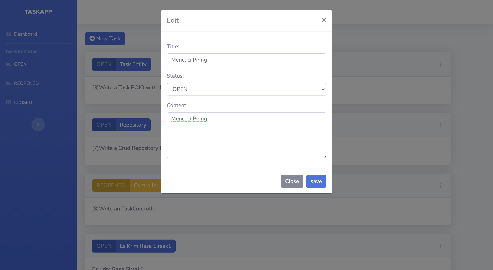
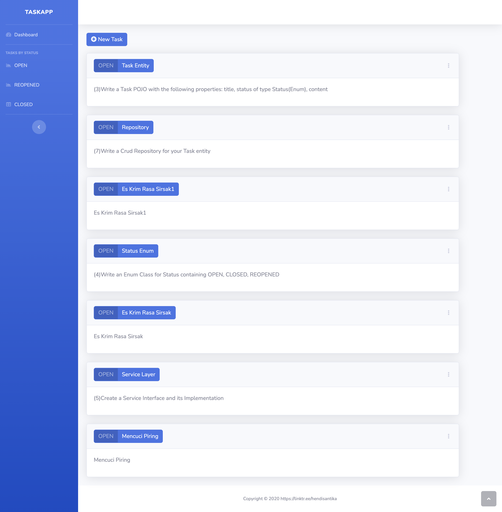
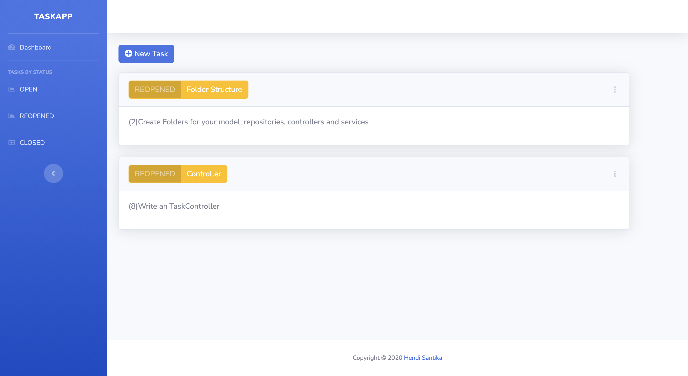
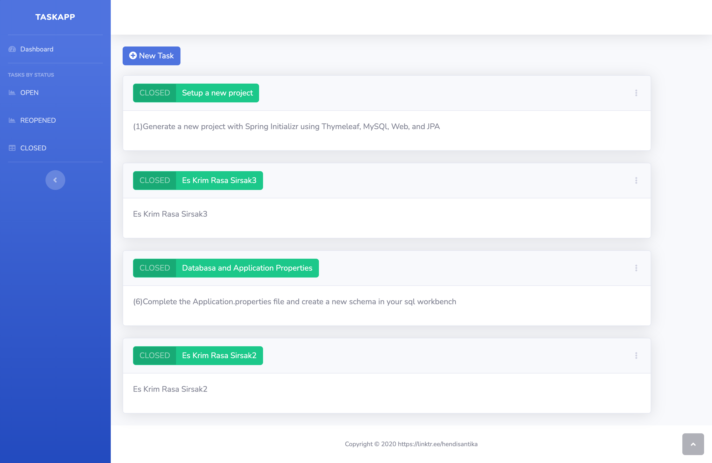

# springboot-taskapp
### Things to do list:
1. Clone this repository: `git clone https://github.com/hendisantika/springboot-taskapp.git`
2. Go folder inside: `cd springboot-taskapp`
3. Run application: `mvn clean spring-boot:run`
4. Open your favorite browser: http://localhost:8000

### Screen shot

Home Page

Add New Task

Open Page

Reopened Page

Closed Page

